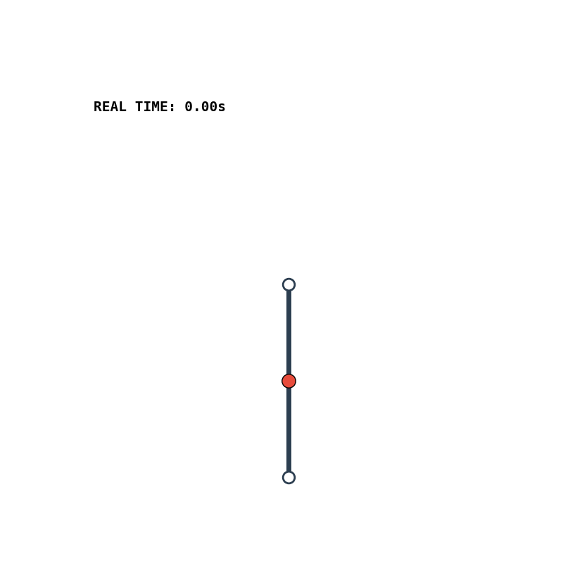
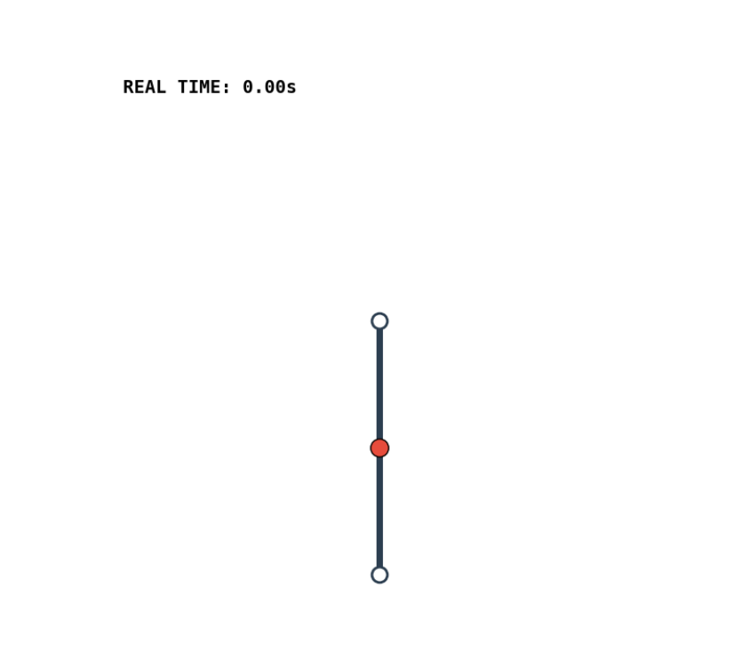
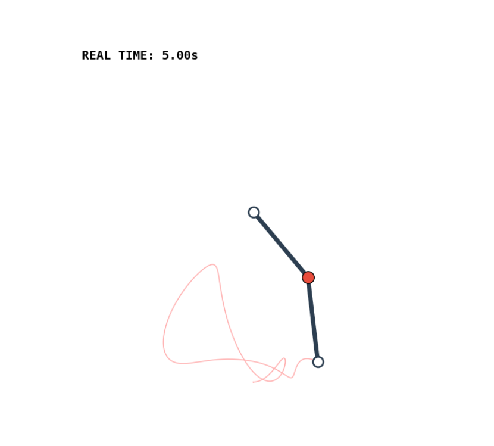
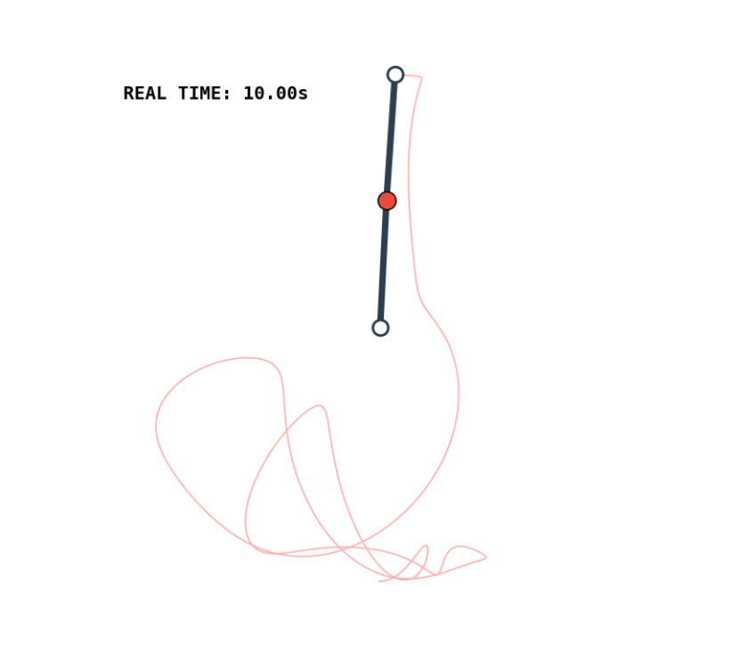

# Acrobot Swing-Up and Stabilization via Optimal Control

<p align="center">
  
</p>

This repository contains the implementation of optimal control techniques for the swing-up and stabilization of an **Acrobot** (underactuated planar gymnast robot). The project was developed as part of the **Optimal Control and Reinforcement Learning** course at the University of Bologna.

## Authors

- **Rubén Gil Martínez**
- **Guillermo López Pérez**

**Professor:** Giuseppe Notarstefano  
**Academic Year:** 2025/2026

---

## Project Overview

The **Acrobot** is a canonical underactuated mechanical system consisting of two links with torque applied only at the hip joint. The primary objective is to drive the system from its stable downward hanging state to the unstable upright equilibrium through a coordinated swing-up maneuver.

### Tasks

| Task | Description |
|------|-------------|
| **Task 0** | System modeling and discretization using 4th-order Runge-Kutta (RK4) |
| **Task 1** | Trajectory generation using iLQR with a step reference |
| **Task 2** | Trajectory generation using iLQR with a smooth (physically-inspired) reference |
| **Task 3** | Trajectory tracking via Time-Varying LQR controller |
| **Task 4** | Trajectory tracking via Model Predictive Control (MPC) |
| **Task 5** | Animation and results visualization |

---

## Requirements

The project requires Python 3.8+ with the following dependencies:

```python
import os
from scipy.optimize import fsolve
import matplotlib.pyplot as plt
from scipy import sparse
import osqp
import numpy as np
from numpy.linalg import inv
from scipy.linalg import solve_discrete_are
import matplotlib.animation as animation
from IPython.display import HTML
```

### Installation

Install all required packages using pip:

```bash
pip install numpy scipy matplotlib osqp ipython
```

Or create a requirements file and install:

```bash
# requirements.txt
numpy>=1.20.0
scipy>=1.7.0
matplotlib>=3.4.0
osqp>=0.6.0
ipython>=7.0.0
```

```bash
pip install -r requirements.txt
```

---

## Project Structure

```
OPTCON_PROJECT/
├── Acrobot_Assignment.pdf          # Project assignment document
└── acrobot-swingup-engine-optcon/
    ├── README.md                   # This file
    ├── notebooks/
    │   └── gymast_robot.ipynb      # Main implementation notebook
    └── reports/
        ├── OPTCON_report_template_.tex  # LaTeX report source
        ├── OPTCON_report_template_.pdf  # Compiled report
        ├── bibfile.bib                  # Bibliography
        └── figs/                        # Generated plots and animations
            ├── acrobot_realtime.gif     # Swing-up animation
            ├── output_task1_*.png       # Task 1 results
            ├── output_task2_*.png       # Task 2 results
            ├── output_task3_*.png       # Task 3 results
            └── output_task4_*.png       # Task 4 results
```

---

## System Description

### Physical Parameters (Set 3)

| Parameter | Symbol | Value |
|-----------|--------|-------|
| Mass of link 1 | $m_1$ | 1.5 kg |
| Mass of link 2 | $m_2$ | 1.5 kg |
| Length of link 1 | $l_1$ | 2.0 m |
| Length of link 2 | $l_2$ | 2.0 m |
| COM distance link 1 | $l_{c1}$ | 1.0 m |
| COM distance link 2 | $l_{c2}$ | 1.0 m |
| Inertia of link 1 | $I_1$ | 2.0 kg·m² |
| Inertia of link 2 | $I_2$ | 2.0 kg·m² |
| Gravity | $g$ | 9.81 m/s² |
| Viscous friction | $f_1, f_2$ | 1.0 N·m·s/rad |

### State Space

- **State vector:** $x = [\theta_1, \theta_2, \dot{\theta}_1, \dot{\theta}_2]^\top \in \mathbb{R}^4$
- **Control input:** $u = \tau \in \mathbb{R}$ (torque at hip joint)

---

## Methods Implemented

### 1. Trajectory Generation (iLQR/DDP)

The iterative Linear Quadratic Regulator (iLQR) algorithm generates optimal trajectories by:
- **Forward Pass:** Simulating dynamics with current control
- **Backward Pass:** Computing feedback gains via Riccati equations
- **Update:** Closed-loop rollout with Armijo line search

### 2. Time-Varying LQR Tracking

A feedback controller with pre-computed gains:
$$u_t = u^{*}_t + K_t (x_t - x^{*}_t)$$

### 3. Model Predictive Control (MPC)

Online optimization with receding horizon:
- Solves QP at each time step using OSQP
- Terminal cost from DARE for stability
- Time-varying linearization along prediction horizon

---

## Usage

1. **Clone the repository:**
   ```bash
   git clone https://github.com/rubengilmartinez/acrobot-swingup-engine-optcon
   cd acrobot-swingup-engine-optcon
   ```

2. **Install dependencies:**
   ```bash
   pip install numpy scipy matplotlib osqp ipython
   ```

3. **Run the notebook:**
   ```bash
   jupyter notebook notebooks/gymast_robot.ipynb
   ```

4. **Execute cells sequentially** to:
   - Define system dynamics and parameters
   - Run trajectory optimization (Tasks 1 & 2)
   - Test LQR tracking (Task 3)
   - Test MPC tracking (Task 4)
   - Generate animations and plots (Task 5)

---

## Results

### Trajectory Generation
- Successfully generates swing-up trajectories from hanging to inverted equilibrium
- Smooth reference (Task 2) shows faster convergence than step reference (Task 1)

### Tracking Performance
- **LQR:** Efficient offline computation, optimal for small perturbations
- **MPC:** Greater robustness under large perturbations, handles constraints

<p align="center">
  
  
  
</p>
<p align="center"><em>Swing-up sequence: Initial → Mid-swing → Final (inverted equilibrium)</em></p>

---

## References

1. G. Notarstefano, "Optimal Control based trajectory generation and tracking," OPTCON Course Notes, University of Bologna, 2025.
2. G. Notarstefano, "Model Predictive Control," OPTCON Course Notes, University of Bologna, 2025.

---

## License

This project was developed for educational purposes as part of the Optimal Control and Reinforcement Learning course at the University of Bologna.
